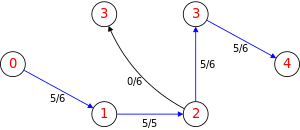

# Cafe-Flow-Maximizer

This project is a class assignment at ENSIIE in the "functional programming" course. 
The goal was to implement the Dinic algorithm to solve the maximum flow problem using [Ocaml](https://ocaml.org/).
In the context of this project, we will use it to maximize the flow of coffee from a source to a sink.

<p align="center">
    
</p>

This project is split into 3 parts : 
- Implementation of the graph data structure 
- Implementation of the BFS algorithm
- Implementation of the Dinic algorithm 

## Table of contents

 - [Requirements](#requirements)
 - [Usage](#usage)
 - [Sources](#sources)

## Requirements

This project requires Ocaml and Make :

For Debian distributions, you can install the libraries using the following command:

```bash
sudo apt-get install ocaml make
```

## Usage

To compile the project, you can use the following command:

```bash
make 
```

Then to run the project, you can use those commands:

```bash
./phase1 "name_of_file.txt"
```
This command will run the second part of the project, which is the implementation of the BFS algorithm.
It will use an input file to create a graph, and then it will run the algorithm.
An output file will then be created.

```bash
./phase2 "name_of_file.txt"
```
This command will run the third part of the project which is the implementation of the Dinic algorithm and also create an output file.

```bash
./test
```
This command will run the set of test made to test the implementation of the graph data structure with the BFS algorithm and the Dinic algorithm.


## Sources

- [Ocaml](https://ocaml.org/)
- [Dinic's algorithm](https://en.wikipedia.org/wiki/Dinic's_algorithm)
- [Video explaining the Dinic algorithm](https://www.youtube.com/watch?v=M6cm8UeeziI)

## Disclaimer

The file analyse.ml and analyse.mli are not written by us.
They are provided by the teacher of the course.
Comments are in French.
The picture's from wikipedia.